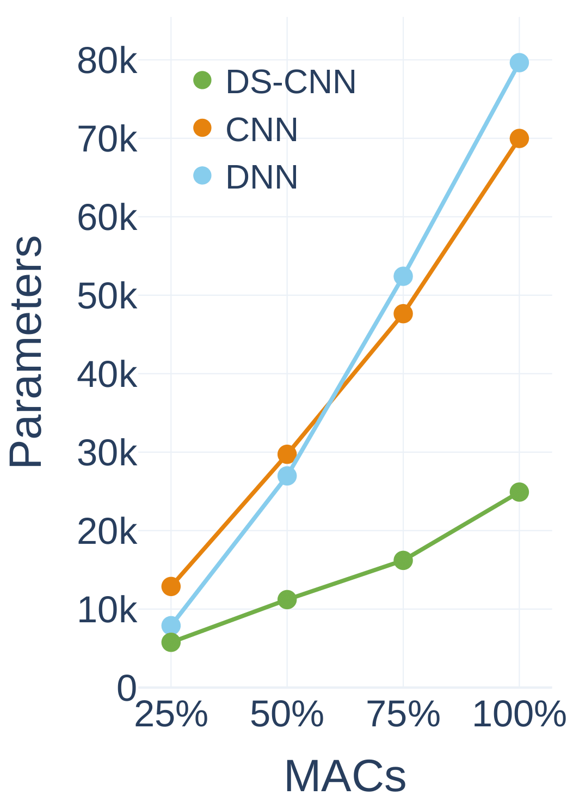
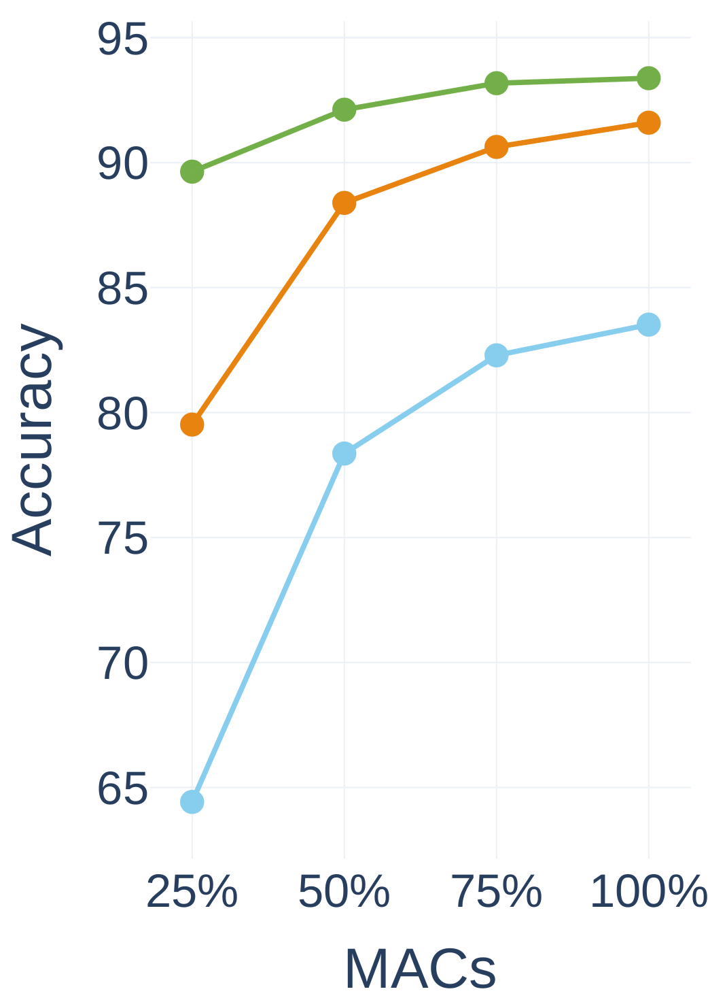
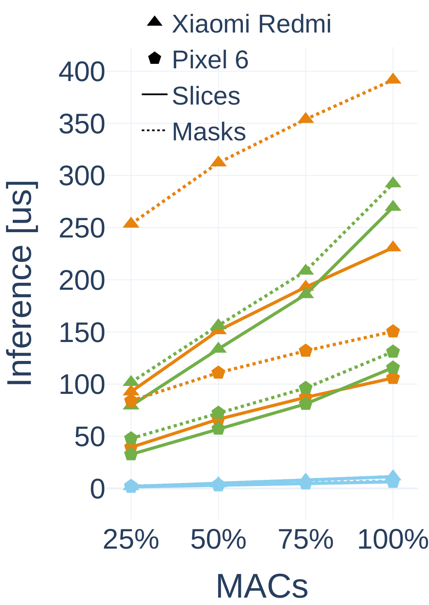
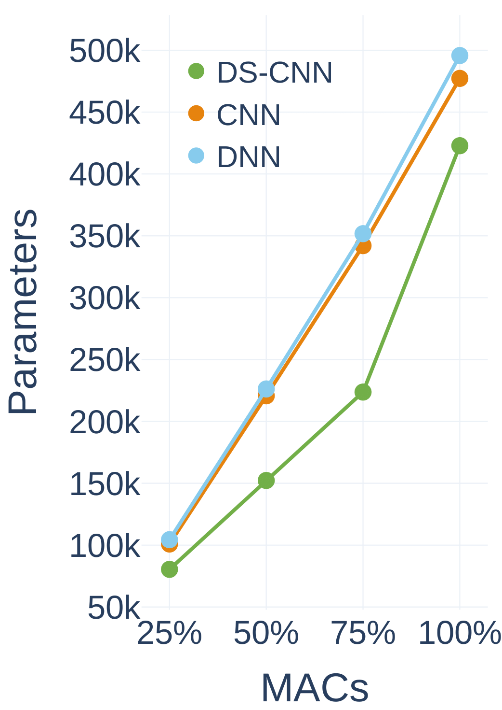
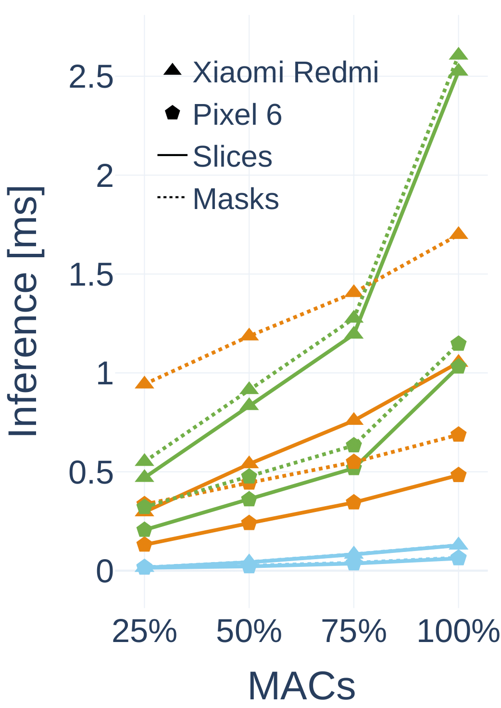

# REDS: Resource-Efficient Deep Subnetworks for Dynamic Resource Constraints

## Software prerequisites

Install the software packages required for reproducing the experiments by running the
command: `pip3 install -r requirements.txt` inside the project folder.

Run the `setup.sh` script file to create the hierarchy of folders used to store the results of the experiments.

[Install](https://support.gurobi.com/hc/en-us/articles/360044290292-How-do-I-install-Gurobi-for-Python-)
the [GUROBI](https://www.gurobi.com/) solver and obtain
a license (
see [free academic license](https://support.gurobi.com/hc/en-us/articles/360040541251-How-do-I-obtain-a-free-academic-license-)).
To link the license and the solver to the programs you have to pass the arguments: **--gurobi_home** and
**--gurobi_license_file** to each program. The former points to the absolute path of the installation of Gurobi and the
latter to its license.

```
python kws_ds_convolution.py --gurobi_license_file path/to/license/gurobi.lic --gurobi_home path/to/installation//gurobi/gurobi1002/linux64 
```

Change linux64 with your operating system version.

## Training REDS models

For each program, you can specify the usage of the GPU by passing an id number from the  `--cuda_device` argument. In the default configuration, all the experiments results are stored inside the /logs directory and printed to the screen.
For each program, you can specify the solver's maximum running time per iteration by passing the value in seconds to the
`--solver_time_limit` argument. For the DS-CNN size L, the suggested time is at least 3 hours (10800
seconds). The final number of pointwise filters (e.g. final feature vector dimension) can be specified by passing the value
to the `--last_pointwise_filters`
argument.

All the individual subnetwork architectures can be trained in isolation by running the `_full_training.py` files. 

**Train DNN models**

```
python kws_dnn.py --gurobi_license_file path/to/license/gurobi.lic --gurobi_home path/to/installation//gurobi/gurobi1002/linux64 
```

**Train CNN models**

```
python kws_convolution_cnn.py --gurobi_license_file path/to/license/gurobi.lic --gurobi_home path/to/installation//gurobi/gurobi1002/linux64 
```

**Train DS-CNN models**

```
python kws_ds_convolution.py --gurobi_license_file path/to/license/gurobi.lic --gurobi_home path/to/installation//gurobi/gurobi1002/linux64 
```


## Analysis results on Pixel 6 and Xiaomi Redmi Note 9 Pro 
The results obtained from the subnetworks configuration are obtained from the official Google
Tensorflow Lite benchmarking [tool](https://www.tensorflow.org/lite/performance/measurement). From left to right: number of model parameters, model accuracy and model inference
as a function of MAC percentage in each REDS subnetwork. 

**(1) Models size S**

   

**(2) Models size L**

  
